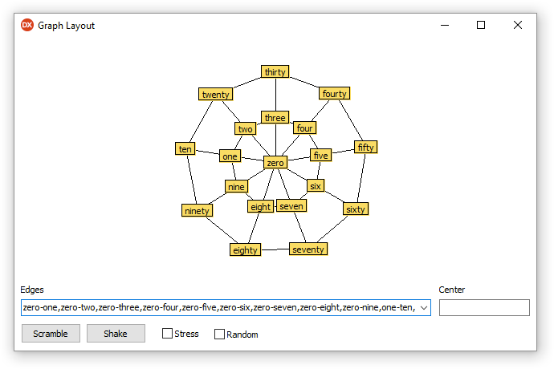

# Graph Layout

Delphi port of [http://www.oracle.com/technetwork/java/example1-140112.html](http://www.oracle.com/technetwork/java/example1-140112.html)

## References

Graph Layout (example 1) 
http://www.oracle.com/technetwork/java/example1-140112.html

Graph Layout (example 2) 
http://www.oracle.com/technetwork/java/example2-139674.html

Graph Layout (example 3) 
http://www.oracle.com/technetwork/java/example3-138466.html

Graph Layout (example 4) 
http://www.oracle.com/technetwork/java/example4-140036.html

## License

Graph Layout is released under the MIT license.
See [LICENSE-DELPHI](./LICENSE-DELPHI.md) for details.
